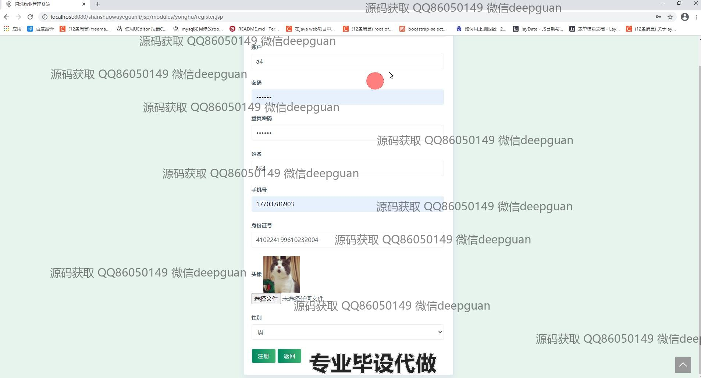

<h1 align="center">闪烁物业管理系统</h1>

## 简介
闪烁物业管理系统：角色分为管理员、用户；功能包括用户管理、物业管理、售水管理、公告管理、物业费管理、服务管理、公共设施管理等，支持全方位物业管理与信息流通。    --计算机毕业设计源码；毕设源码；java毕业设计源码

## 联系方式

<h3 align="center">获取完整代码与数据库文件 + 微信：deepguan QQ: 86050149 QQ群: 783742310</h3>

<h3 align="center">可帮忙远程部署 包运行成功！提供远程部署、修改代码、设计文档指导、代码讲解等服务！</h3>

## 功能介绍（完整见运行截图）
管理员：基础功能包括用户登录、注册和退出。系统主页具有主导航栏和多个管理模块，如个人中心、用户管理、物业管理、公告管理等，方便访问不同功能。管理员可以进行公告的查看、添加、修改及删除，以及公告类型的选择和年份筛选。物业费管理允许查看和更新缴费及未缴费状态。服务管理提供服务详情查看与修改，支持添加和批量删除操作。

用户：用户可以进行基本操作，如登录、注册和退出。主页提供简洁的导航菜单，以访问个人中心等功能模块。用户信息管理涵盖信息的查看与修改，如姓名、手机号和头像等，支持上传及编辑操作。物业费管理界面让用户查询缴费记录及状态，包括查看特定年份的缴费情况，并支持新增或返回上一步。服务列表模块允许用户查看提供的物业服务详情和进行服务查询。

## 运行截图

本代码来源于网络,仅供学习参考使用!

